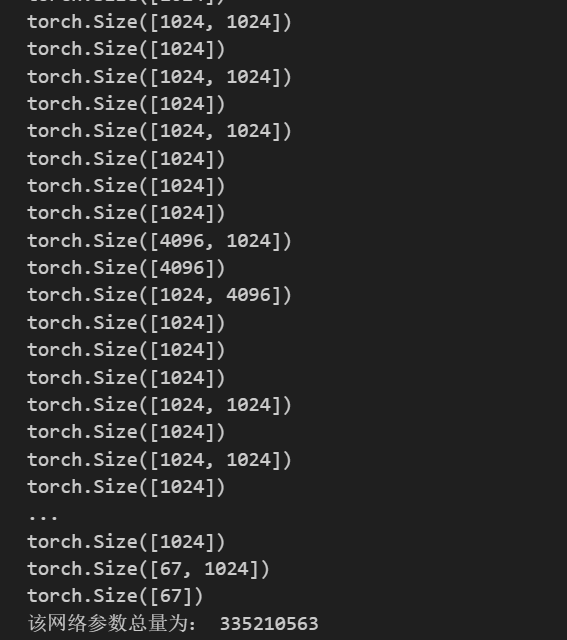
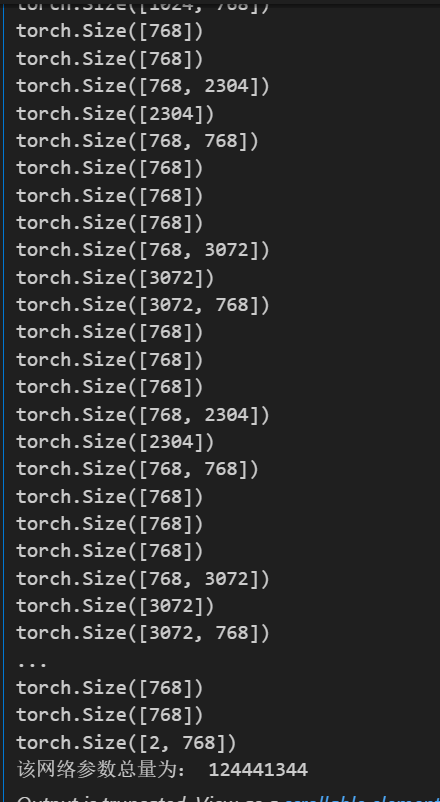
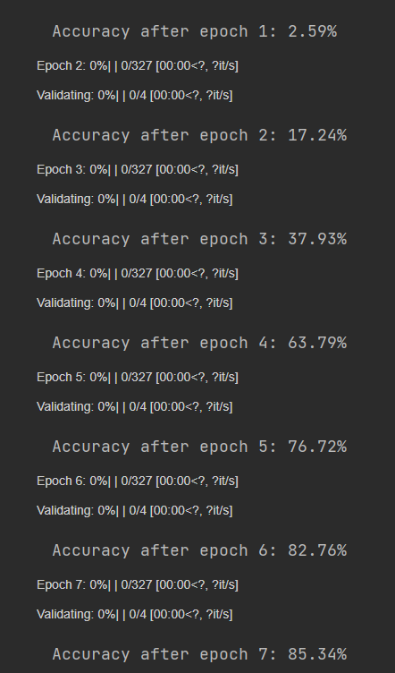
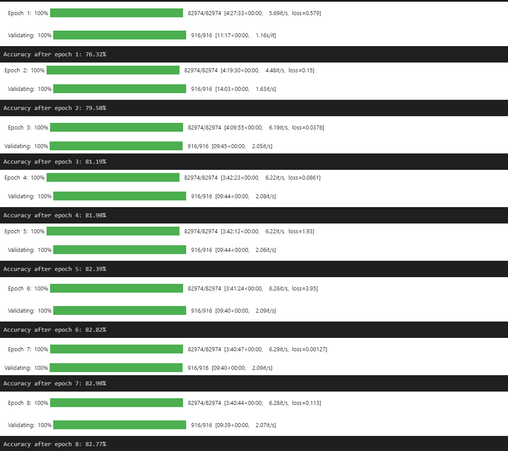
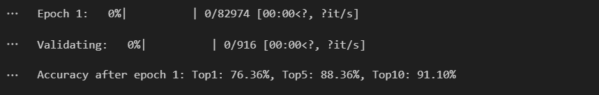
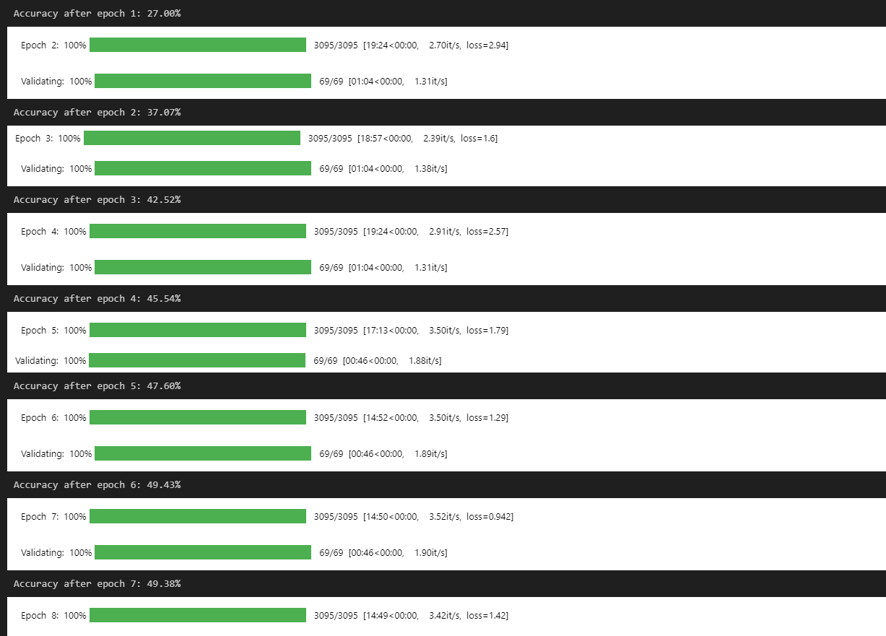
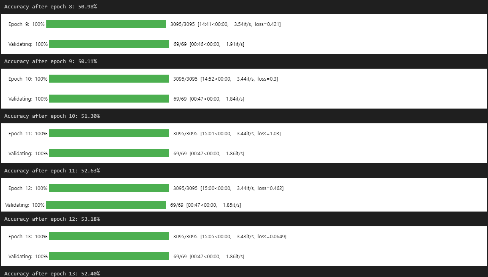
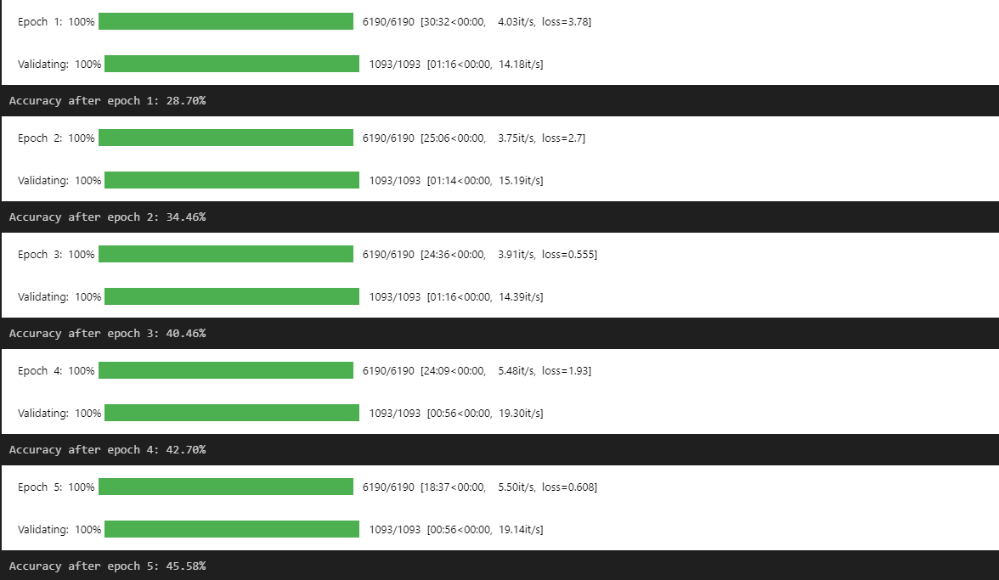
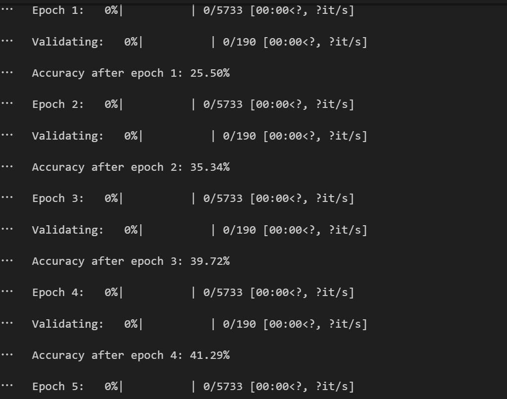
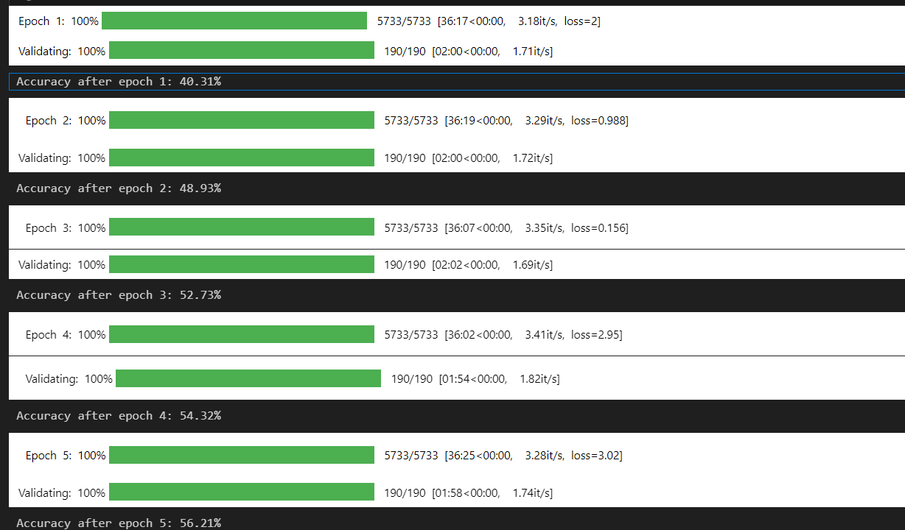

# 模型对比

### bert base的参数量

12层 transformer结构


109533763的参数量 

### bert large的参数量

24层transformer结构



### GPT2基础版参数量

12个gpt2 block




# 李建业数据集

早有预料 因为之前抽取了一部分我自己的10-13出现频率开发者的数据集后，得到的 结果确实也很不错

## 10-13出现频率开发者信息



## 李建业数据集 19w数据（历史最佳😊）

好像是加了id 虽然id类似于一个排序的索引序号，但是也能提供语义信息， 所以应该是id+description训练的  至于为何效果如此牛逼 我也不懂，可能是因为id+description过长，远远超出512长度，使得bert能够更好的调整每个词向量的权重 



加入top5 top10 （断电了宿舍 所以是两段）




# 学长数据集（若无明确标注 皆为eclipse那个数据集）

## BERT 学长数据集

1.ecliipse去除history bert模型





## GPT2学长数据集 去除history



## bert12层学长数据集

id+description 目前推测是因为decsription那一列长短不一 ，有的长度到达了512 有的没有到达，难以设置bert模型对每一个词的权重导致的问题



## bert12层  学长数据集 重新预处理+输入优化 top1

考虑到注意力机制和学习bert的一些经验，最好让description的字段长度差不多  所以这次使用abstract这一列试一试 这样每次输入的文本长度大小几乎一样

```python
df['text_input'] =  df['bug_id'].astype(str) + " " + df['component'].astype(str)+ " " + df['abstracts'].astype(str)  # 使用空格作为分隔符

```

为什么这样搞？id和component作为一种标识放在最前面方便bert调整前面几个权重，将与developer息息相关的内容abstract放在最后（因为abstract要比description规整很多）方便bert调整后面几个词向量的权重 因为本质是使用bert的MLM模型，然而MLM模型又是基于上下文的， 将预测的内容做成掩码再让bert去猜 ，所以规整的数据对于训练bert的文本分类应该是比较好的方式。



提升了，但是感觉不能达到我想要的那种百分之80的感觉。不过感觉这也是极限了

## bert12层  学长数据集 重新预处理+输入优化 top1 top5 top10对比

